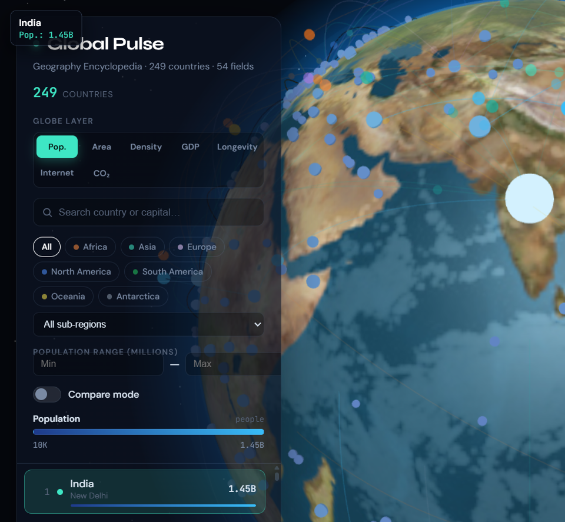

# Global Pulse

**An interactive geography encyclopedia on a premium 3D globe** — 249 countries, 54 fields each, animated data arcs, metric choropleth layers, tabbed detail panels, and a typed Vercel API.


**[Live demo → global-three-one.vercel.app](https://global-three-one.vercel.app/)**

<p align="center">
  <a href="https://global-three-one.vercel.app/">
    
  </a>
  <br/>
  <sub><i>249-country geography encyclopedia · custom day/night shaders · metric layers · compare mode</i></sub>
</p>

---

## Why this exists

Most "globe demos" stop at a textured sphere and a tooltip. **Global Pulse** is a full-stack geographic exploration platform:

- **Thousands of bundled data points** (249 × 54 fields) — no API keys, works offline after first load
- **Staff-level 3D craft** — custom Fresnel atmosphere, day/night shader, instanced markers, region flow arcs, compare arc
- **Encyclopedia UX** — tabbed detail drawer (Overview · Geography · Demographics · Economy · Culture), search + filters, side-by-side compare, mini charts
- **Real backend** — Vercel serverless API with pagination, filtering, OpenAPI-ready handlers, shared TypeScript types

---

## Architecture

```
┌─────────────────────────────────────────────────────────────────────────┐
│                         DATA PIPELINE (build time)                      │
├─────────────────────────────────────────────────────────────────────────┤
│  mledoze/countries JSON  +  World Bank population CSV                   │
│              │                                                          │
│              ▼                                                          │
│     scripts/generate-encyclopedia.mjs                                   │
│              │                                                          │
│     ┌────────┴────────┐                                                 │
│     ▼                 ▼                                                 │
│ encyclopedia.json   globe-index.json   (249 countries, 54 fields)       │
│ (~1.4 MB)           (~59 KB, globe-optimized)                           │
└─────────────────────────────────────────────────────────────────────────┘
                    │                              │
                    ▼                              ▼
┌──────────────────────────────┐    ┌──────────────────────────────────────┐
│   VERCEL API (serverless)    │    │   REACT + R3F FRONTEND               │
├──────────────────────────────┤    ├──────────────────────────────────────┤
│ GET /api/countries           │    │ GlobeScene (shaders, instancing)     │
│ GET /api/countries/:code     │    │ EncyclopediaDrawer (5 tabs)        │
│ GET /api/compare?a=&b=       │    │ ComparePanel + compare arc           │
│ GET /api/stats/aggregate     │    │ Metric layers (10 choropleth keys)   │
│                              │    │ Search · continent · region · pop    │
│ Shared types: shared/types.ts│◄──►│ Vitest · ESLint · Prettier           │
└──────────────────────────────┘    └──────────────────────────────────────┘
```

---

## Data sources

| Source | Used for |
|--------|----------|
| [mledoze/countries](https://github.com/mledoze/countries) | Names, capitals, flags, borders, currencies, languages, coordinates, area |
| [World Bank open data](https://data.worldbank.org/) (population CSV) | Authoritative population figures (India #1 as of 2024–25) |
| Curated enrichment script | Climate, peaks, rivers, GDP estimates, UNESCO counts, connectivity, HDI, governance, etc. |

**Scale:** **249 countries × 54 fields ≈ 13,446 data points**, pre-bundled in `public/data/` and `data/`.

### Field categories (54 total)

| Category | Examples |
|----------|----------|
| Identity | `code`, `iso3`, `name`, `officialName`, `flag`, `capital` |
| Geography | `lat`, `lng`, `borders`, `climateZone`, `highestPeak`, `longestRiver`, `coastlineKm`, `landlocked` |
| Demographics | `population`, `density`, `medianAge`, `urbanPercent`, `lifeExpectancy`, `fertilityRate` |
| Economy | `gdpNominal`, `gdpPerCapita`, `mainExports`, `unemployment`, `inflation` |
| Culture | `unescoSites`, `nationalDay`, `religions`, `languages`, `currency` |
| Connectivity | `internetUsers`, `mobilePenetration`, `timezones`, `callingCode` |
| Development | `hdIndex`, `literacyRate`, `healthcareIndex`, `co2PerCapita`, `forestCover`, `renewableEnergy` |

---

## API endpoints

All endpoints are Vercel serverless functions under `/api/`. Query params support pagination and filtering.

| Method | Path | Description |
|--------|------|-------------|
| `GET` | `/api/countries` | Paginated list. Params: `page`, `pageSize`, `search`, `continent`, `region`, `language`, `popMin`, `popMax`, `sort`, `order` |
| `GET` | `/api/countries/:code` | Full 54-field encyclopedia record (e.g. `/api/countries/JP`) |
| `GET` | `/api/compare?a=US&b=JP` | Side-by-side comparison payload for two ISO codes |
| `GET` | `/api/stats/aggregate` | World totals, continent breakdown, top-by-population/GDP |

The frontend falls back to static `/data/encyclopedia.json` when API routes are unavailable (local Vite dev).

---

## Features

### 3D globe (React Three Fiber)

- **Custom day/night shader** on the sphere with specular ocean highlights
- **Fresnel atmosphere** rim glow (accent-tinted)
- **249 instanced data nodes** — color/size scaled by active metric (linear / log / sqrt)
- **Region flow arcs** — animated pulses between filtered countries
- **Compare arc** — great-circle link when two countries are selected in compare mode
- Smooth orbit controls, auto-rotation (respects `prefers-reduced-motion`)

### Dashboard & encyclopedia

- **10 metric layers:** population, area, density, GDP/capita, life expectancy, internet, CO₂, HDI, UNESCO sites, forest cover
- **Search + filters:** continent pills, sub-region dropdown, population range
- **Encyclopedia drawer:** skeleton loading, 5 tabs, 54 fields formatted per type
- **Compare mode:** pick any 2 countries → `ComparePanel` with bar charts
- **Responsive:** mobile sheet layout, keyboard-accessible controls, focus rings

---

## Tech stack

| Layer | Technology |
|-------|------------|
| 3D | Three.js · @react-three/fiber · @react-three/drei |
| UI | React 19 · Framer Motion · CSS design tokens (glass panels, dark theme) |
| Language | TypeScript strict (shared types front + API) |
| Build | Vite 8 · code-split chunks (R3F lazy-loaded) |
| API | Vercel Node serverless (`@vercel/node`) |
| Quality | Vitest · ESLint · Prettier |

---

## Senior techniques used

- **Build-time data pipeline** — reproducible `generate:data` script; no runtime secrets
- **Dual payload strategy** — lightweight `globe-index.json` for rendering + full `encyclopedia.json` on demand
- **InstancedMesh** for 249 nodes (single draw call) vs. 249 individual meshes
- **Custom GLSL** day/night + atmosphere shaders (not stock `MeshStandardMaterial`)
- **Metric normalization** with linear / log / sqrt scales per data shape
- **Shared TypeScript contracts** (`shared/types.ts`) consumed by API handlers and React hooks
- **Selection guard** (`ignoreDeselectRef` + `queueMicrotask`) — sidebar clicks don't clear globe selection
- **Progressive enhancement** — API fetch with static JSON fallback in `useCountryDetail`
- **a11y** — reduced motion, semantic roles, searchbox labels, focus-visible styles

---

## Run locally

```bash
git clone https://github.com/Jorgeotero1998/GlobalThree.git
cd GlobalThree
npm install
npm run dev          # http://localhost:5173
```

### Commands

```bash
npm run generate:data   # Regenerate encyclopedia + globe index from seed files
npm run build           # generate:data → tsc → vite build
npm run preview         # Serve production build
npm test                # Vitest (33 tests)
npm run lint            # ESLint
npm run typecheck       # tsc --noEmit
```

---

## Project structure

```
api/
├── countries/index.ts      # GET /api/countries
├── countries/[code].ts     # GET /api/countries/:code
├── compare.ts              # GET /api/compare
├── stats/aggregate.ts      # GET /api/stats/aggregate
└── lib/query.ts            # Shared query logic + tests
data/                         # Source seed files (mledoze + World Bank CSV)
public/data/                  # Bundled JSON served statically
scripts/generate-encyclopedia.mjs
shared/types.ts               # CountryRecord, MetricKey, API response types
src/
├── three/                    # GlobeScene, shaders, instanced points, arcs
├── components/               # EncyclopediaDrawer, ComparePanel, Sidebar…
├── hooks/                    # useCountryView, useCountryDetail
├── data/                     # metrics, globe-index import
└── lib/                      # geo math, formatters, metric helpers
```

---

## Deploy

Configured for **[Vercel](https://vercel.com)** — project `global-three`, production domain `global-three-one.vercel.app`.

| Setting | Value |
|---------|-------|
| Git repo | `Jorgeotero1998/GlobalThree` |
| Branch | `main` |
| Root directory | `.` |
| Build command | `npm run build` |
| Output directory | `dist` |

Push to `main` should auto-deploy. If the live URL shows an old build after pushing, promote manually:

```bash
npx vercel link --project global-three --yes
npx vercel deploy --prod --yes
npx vercel alias set <deployment-url> global-three-one.vercel.app
```

---

## License

MIT — see [LICENSE](./LICENSE)

---

Built by **[Jorge Otero](https://github.com/Jorgeotero1998)** · Full Stack Developer since 2023
